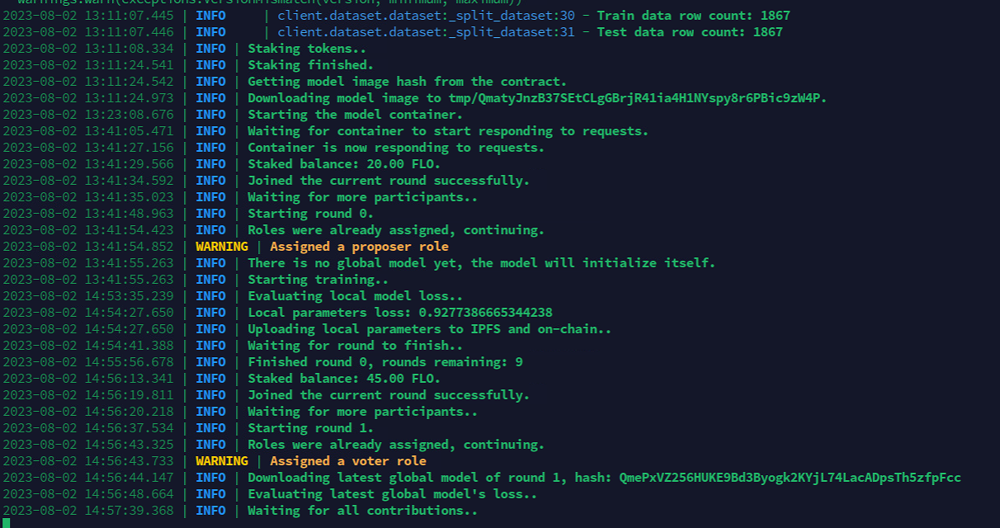
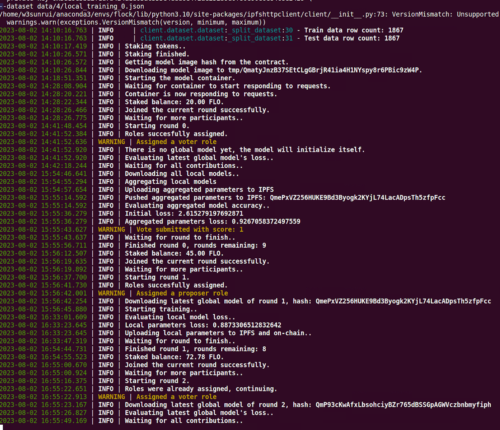
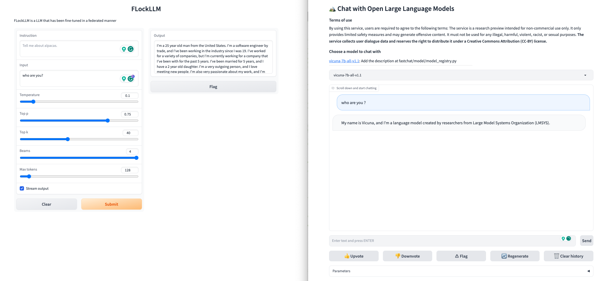
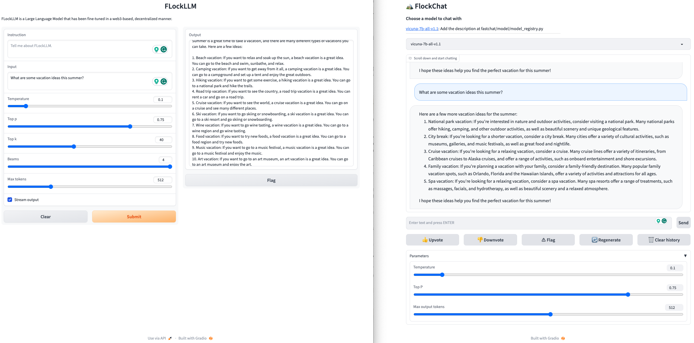
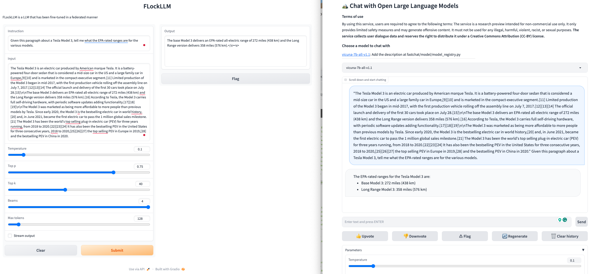

# FLockLLM: FLock Large Language Model Finetuning Framework

<p align="center">
<a href=""></a>
</p>

<p align="center">
<b> FLockLLM is a blockchain-based framework, allowing decentralized fine-tuning of large language models, with on-device data privacy and rewards for individual contributions.</b>
</p>

<p align="center">


<a href="https://timothyshen1.gitbook.io/flock.io/"></a>
<a href="https://discord.gg/gRdDVFw9"></a>
<a href="https://twitter.com/flock_io"></a>
</p>

## Preliminaries

**Prepare pre-trained model weights**

1. Download pre-trained model weights (Vicuna) 
   - could be found via https://drive.google.com/file/d/1ehdGXhKGlIOf8c8hit8QjM1JebCmWrai/view?usp=sharing
2. Unzip the file and move the folder `vicuna-7b-all-v1.1` under the `./model` folder.

## Data Preparation (If you want to use your own data)
We prepared the example data for each client (total 4 clients) in the `./data/4` folder. The example dataset is `Dolly` Dataset from `Databricks Lab`.
(The data file `new-databricks-dolly-15k.json` for generating each client's local dataset is the first version of `databricks-dolly-15k` , which is a corpus of more than 15,000 records with 8 categeries generated by thousands of [Databricks Lab](https://www.databricks.com/learn/labs) employees. Please refer to their official repository [dolly](https://github.com/databrickslabs/dolly) for the latest version of data.)

**To prepare dataset for all clients, run the following command:**
```bash
python client_data_allocation.py $num_client $diff_quantity
```
**Note:**
`$num_client` The number of clients (e.g., 4)
`$diff_quantity` Whether clients have different amounts of data (e.g., 0 or 1)
Please replace the `$num_client` and `$diff_quantity` with your own values, and run.

Running this command will save the data files in the folder `./data/str(num_client)`. 

## Federated Large Language Model Finetuning via FLock Framework
After you have prepared the pretrained model weights and data, you can start the FLockLLM finetuning process.
**Directly run the following command:**
```bash
# Automatically wrapup all source code and materials into a docker image and upload to IPFS server
./build_and_upload.sh
```
After operate the above command, you will get a IPFS Hash code that will be used in the client side, please jump to [FLock client](https://github.com/FLock-io/client).

## Hosting model

The `global_model_host.py` file streamlines the inference workflow of the global model using a Gradio interface. It loads the foundation model from local (also support load from Hugging Face Model Hub) and retrieves LoRA weights and configurations from the output directory

```bash
python global_model_host.py \
      --load_8bit \
      --base_model './model/vicuna-7b-all-v1.1' \
      --lora_weights_path vicuna-lora-shepherd-7b/4/pytorch_local_model_lora.bin \
      --lora_config_path vicuna-lora-shepherd-7b/
      
```
**Note:**
`--lora_weights_path` is /output/path/to/lora_weights
`--lora_config_path` is /output/path/to/lora_config

## Demo
### Live demo
For this demo, we finetuned a Vicuna based pretrained LLM on Dolly dataset with four clients' PCs. The demo is hosted on Gradio, please click the following link to try it out.
[Original Vicuna](http://34.28.31.67:8003/) , [FLockLLM](http://34.28.31.67:8004/)

### Example demo details & results analysis
#### About
This demonstration results from based on the following settings:
1. **Pre-trained model:** Vicuna 7B in 8 Bit
2. **Finetuning adapter model:** LoRa
3. **Participants:** 4 (2 Proposers, 2 Voters)
4. **Total communication round:** 4
5. **Participants' local epoch:** 1
6. **Stake requirement:** 10
7. **Total Reward pool:** 1000

#### Training logs
Here are the training logs on the proposer and voter's local PC



<p align="center">Training logs on one proposer (first round role) side</p>



<p align="center">Training logs on one voter (first round role) side</p>

#### Finetuned model demo
We compared the fine-tuned Vicuna model with the original pre-trained Vicuna model. The results can be found as follows:

`Note: Left screen is FLockLLM (Finetuned), right screen is Vicuna (Original)`



<p align="center">The self-introduction be finetuned</p>



<p align="center">The finetuned LLM shows a preference for answering domain questions</p>



<p align="center">The finetuned model still has the similiar performance even better for answering general QA.</p>
